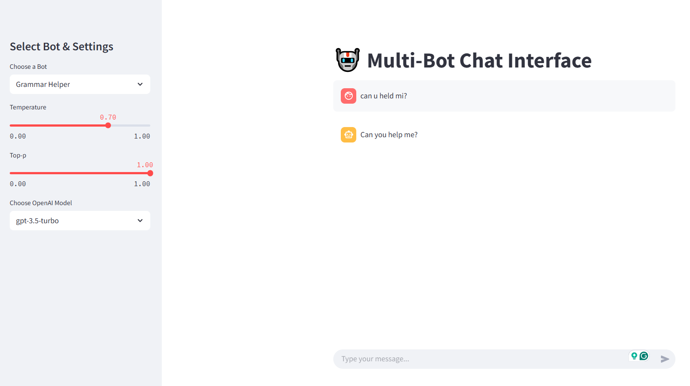

# Multi-Bot Interface Platform

A modular AI platform featuring multiple bots accessed via a Streamlit frontend and FastAPI backend middleware. Users can choose different bots such as `Ask Me Anything`, `Grammar Helper`, `Compare Files`, and `Agreement Generator`, with history management and customizable parameters like temperature.

---



## Project Structure

```
multibot_interface_project/
│
├── .gitignore
├── README.md
├── requirements.txt
│
├── bots/
│   ├── agreement_generator/
│   │   ├── main.py
│   │   └── service.py
│   ├── ask_me_anything/
│   │   ├── main.py
│   │   └── service.py
│   ├── compare_files/
│   │   ├── main.py
│   │   └── service.py
│   └── grammar_helper/
│       ├── main.py
│       └── service.py
│
├── components/
│   ├── faiss_db.py
│   ├── search_api.py
│   └── utils.py
│
├── data/
│   ├── image.png
│   └── uploads/
│
├── env/
│   ├── pyvenv.cfg
│   ├── etc/
│   ├── Include/
│   ├── Lib/
│   ├── Scripts/
│   └── share/
│
├── logs/
│   ├── ask_me_anything.log
│   ├── grammar_helper.log
│   ├── middleware.log
│   └── streamlit_app.log
│
├── middleware/
│   └── main.py
│
├── shared/
│   └── credentials.yml
│
└── streamlit_app/
    ├── app.py
    └── __pycache__/
```

---

## Setup Instructions

1. **Clone the repository**

   ```bash
   git clone https://your-repo-url.git
   cd multibot_interface_project
   ```

2. **Create and activate Python virtual environment**

   ```bash
   python3 -m venv env
   # On Linux/Mac:
   source env/bin/activate
   # On Windows:
   env\Scripts\activate
   ```

3. **Install dependencies**

   ```bash
   pip install -r requirements.txt
   ```

4. **Configure credentials**

   Add your API keys and any other sensitive configuration in:

   ```
   shared/credentials.yml
   ```

5. **Run FastAPI Middleware**

   From the project root:

   ```bash
   uvicorn middleware.main:app --reload --host 0.0.0.0 --port 8000
   ```

6. **Run Streamlit Interface**

   In another terminal (with the environment activated):

   ```bash
   streamlit run streamlit_app/app.py
   ```

---

## Features

- **Multiple bots** accessible via a sidebar selector:
  - Ask Me Anything
  - Grammar Helper
  - Compare Files
  - Agreement Generator
- **Session management** with auto-generated session IDs.
- **Chatbot-like UI** with persistent chat history per bot.
- **Temperature and other LLM parameters** adjustable in sidebar.
- **Middleware** to route requests from frontend to appropriate bot API.
- **Centralized logging** in the `logs/` folder for each component.
- **Document upload and retrieval** for context-aware responses (Ask Me Anything bot).

---

## Notes

- The virtual environment folder `env/` is included in `.gitignore` and should not be committed.
- Logs are stored in the `logs/` folder:
  - `middleware.log` for middleware events and errors
  - `streamlit_app.log` for frontend events and errors
  - `ask_me_anything.log` for Ask Me Anything bot logs
  - `grammar_helper.log` for Grammar Helper bot logs
- Credentials and sensitive info must be kept private in `shared/credentials.yml`.
- Uploaded files are stored in `data/uploads/`.

---

## Future Enhancements

- Implement logic for all bots in their respective `service.py` and `main.py` files.
- Add more bots under `bots/`
- Improve error handling and retry mechanisms
- Enhance UI/UX with richer chat features and file uploads
- Containerize with Docker for easier deployment

---

## License

Specify your license here.

---

## Contact

For any questions or suggestions, feel free to reach out:

  - Email: esragcetinkaya@gmail.com
  - Linkedin: [esragcetinkaya](https://www.linkedin.com/in/esra-gul-cetinkaya/?locale=en_US)
